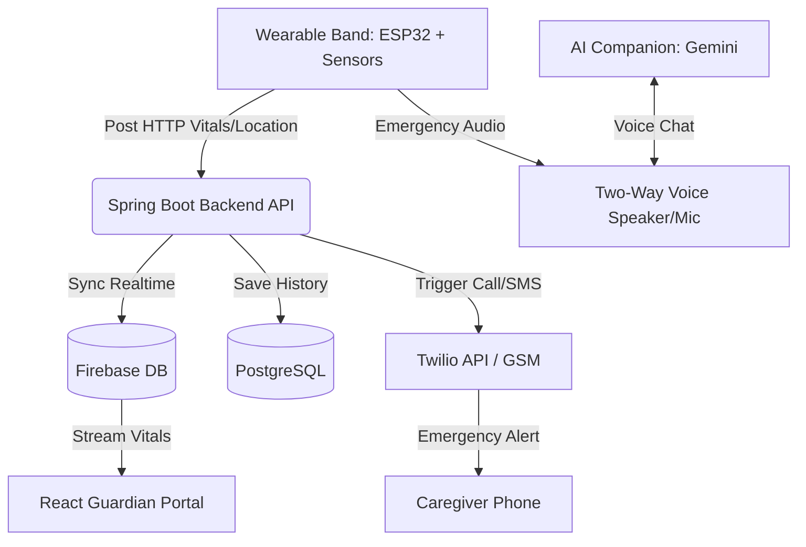

## ♦ SilverCare: Proactive AI Platform for Elderly Assistance, Health Monitoring & Caregiver Support

### 📦 Deployed System

- **Frontend & Complete Website (Vercel):** https://silver-care-eta.vercel.app/
- **Backend (Railway):** https://silvercare-production-3455.up.railway.app

> Use the **frontend link** to share the full SilverCare system (frontend UI powered by the backend API) with users; the **backend link** is provided for developers needing direct API access.

### ⚡ Quick Test Credentials

To fast test, you can use the following sample login credentials:

**Guardian**
- Username: `sourabh`
- Password: `123456`

**Elderly**
- Full name: `Anil Shinde`
- Phone no.: `7776956902`

---

## ♦ The Challenge

With the increasing elderly population, many senior citizens live alone without continuous supervision, leading to critical safety risks:

*   **Frequent Falls:** The leading cause of severe injuries and health complications in older adults.
*   **Delayed Emergency Assistance:** Seniors are often unable to seek help immediately when a crisis occurs.
*   **Unnoticed Instability & Prolonged Inactivity:** Gradual physical decline and abnormal patterns go undetected without continuous monitoring.
*   **Medication Non-Adherence:** Forgetting or missing critical prescription doses leads to severe health relapses.

### ❓ But, are there no existing solutions in the market?
While many tracking systems exist, they fall short because:
1.  **Fitness Focus Only:** Existing commercial products prioritize general fitness tracking over specific elderly risk detection.
2.  **High False Positives:** Inaccurate readings erode trust in monitoring systems.
3.  **Reactive, Not Proactive:** They only trigger *after* a catastrophe has happened, rather than predicting or mitigating risks beforehand.
4.  **No Companionship:** The critical issues of isolation, loneliness, and mental/emotional support are completely unaddressed.
5.  **Nuclear Family Gaps:** Distance and busy routines leave family members unable to supervise 24/7.

---

## ♦ Proposed Solution

**SilverCare** is a proactive, intelligent, and wearable system designed to bridge these safety and communication gaps:

*   **Smart Wearable Waistband + Wristband System:** Comfortable for continuous daily wear. Positioned at the waist for superior biomechanical fall-detection compared to wrist-only alternatives, coupled with a secondary wrist band peripheral for ease-of-access.
*   **Multi-Sensor Proactive Monitoring:** Tracks movement, posture, inactivity, and vitals in real time using a tri-sensor configuration (MPU6050, MAX30102, DS18B20).
*   **Smart Fall & State Detection Engine:** Differentiates between normal activity, sudden movement, pre-falls, and genuine falls using a hybrid logic (Thresholds + Decision Trees) to keep false alarms to a minimum.
*   **Integrated Speaker, Mic, & GPS (New Peripherals):** Enables two-way voice communication directly through the wearable device and transmits real-time coordinates during emergencies so help can find them immediately.
*   **Active Medicine Reminders:** Sends timely, audible, and visual alerts ensuring medications are taken on schedule.
*   **AI Companion "Mitra":** An interactive AI companion that chats and keeps seniors company so they never feel alone.
*   **Automatic Caregiver Alerting:** Notifies guardians instantly via Twilio SMS, automated phone calls, or local GSM modules.

---

## ♦ Solution Overview

*   **What & Why?** A smart wearable ecosystem that prevents falls, prevents medication gaps, combats loneliness, and resolves delayed emergency response.
*   **For Whom?** Designed for independent seniors living alone and their guardians/caregivers.
*   **Where & When?** 24/7 continuous monitoring usable anywhere.
*   **But How?** Leveraging integrated hardware sensors, low-power microcontrollers (ESP32), a robust Spring Boot API, a React dashboard, and AI models for fallback classification and companionship.

---

## ♦ Technology Used

### 🔌 Hardware & IoT
*   **Microcontroller:** ESP32 (Low power, Wi-Fi/Bluetooth enabled)
*   **Sensors:** 
    *   `MPU6050` (Motion, orientation, and fall detection)
    *   `MAX30102` (Heart rate & SpO2 monitoring)
    *   `DS18B20` (Body temperature tracking)
    *   `GPS Neo-6M` (Real-time location coordinate tracking)
*   **Peripherals:** Speaker & Microphone (for emergency calls & AI companion), Buzzer (reminders).

### 🤖 AI & Decision Logic
*   **Detection Engine:** Hybrid Decision Trees + Threshold Logic for real-time fall detection.
*   **AI Companion:** Gemini API Integration (powering "Mitra" for emotional support and friendly chats).

### 🌐 Software Stack
*   **Frontend:** React.js (Vite, styled with custom Vanilla CSS for modern glassmorphism dashboards)
*   **Backend:** Spring Boot (Java 17, Maven)
*   **Database:** PostgreSQL (persistent configuration and history), Firebase (real-time data synchronization)
*   **Communication APIs:** Twilio API (voice calling and SMS alerts), GSM serial modules.
*   **Deployment:** Docker, Docker Compose, Vercel (Frontend), Railway (Backend).

---

## ♦ Technical Flow & Architecture

Below is the workflow of data from the device to the dashboard and caregivers:

### 🖼️ Hardware & System Interface Gallery
*(Add physical device and dashboard images below)*
*   **Wearable Prototype:** ``
*   **Guardian Dashboard Interface:** ``

---

## ♦ Repository Structure & Documents

*   [Frontend Code (React)](./Frontend-react)
*   [Backend Code (Spring Boot)](./backend-spring)
*   [ESP32 Firmware Code](./ESP32_codes/ESP32.ino)
*   [Hackathon Problem Statement](./documents/hackathon_problemstatement.pdf)  
*   [Project Presentation](./documents/projectpresentation.pptx)  

---

## ♦ How to Run the Project

For detailed step-by-step local setup instructions, see [Run Instructions](RUNNING.md).

---

Thank You
