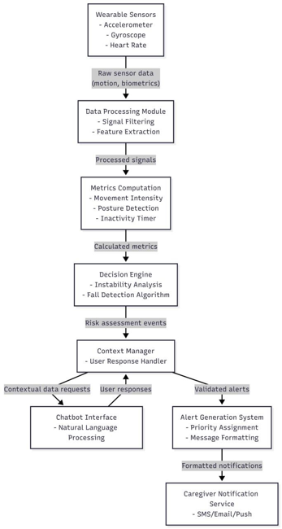
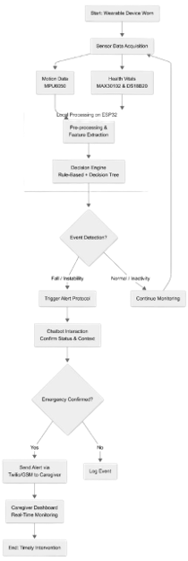

## ♦ SilverCare: Proactive AI Platform for Elderly Assistance, Health Monitoring & Caregiver Support

### 📦 Deployed System

- **Frontend & Complete Website (Vercel):** https://silver-care-eta.vercel.app/
- **Backend (Railway):** https://silvercare-production-3455.up.railway.app

> Use the **frontend link** to share the full SilverCare system (frontend UI powered by the backend API) with users; the **backend link** is provided for developers needing direct API access.

### ⚡ Quick Test Credentials

To fast test, you can use the following sample login credentials:

**Guardian**
- Username: `sourabh`
- Password: `123456`

**Elderly**
- Full name: `Anil Shinde`
- Phone no.: `7776956902`

---

## ♦ The Challenge

With the increasing elderly population, many senior citizens live alone without continuous supervision, leading to safety risks such as:

- Unnoticed Instability & Prolonged Inactivity – Gradual imbalance and abnormal movements go unnoticed. Early warning signs of health issues are missed.
- Medication Non-Adherence – Elderly individuals often forget to take medicines on time, leading to missed doses.
- Delayed Assistance – Senior citizens are unable to seek immediate help during emergencies.
- Frequent Falls – Leading cause of serious health complications.

Without an intelligent and reliable monitoring solution, senior citizens remain vulnerable to preventable injuries and delayed medical intervention.

---

## ♦ Problem Statement

To develop an automated, intelligent, and wearable monitoring system that ensures continuous health tracking, medication adherence, fall detection, and instant emergency alerts for elderly individuals.

---

## ♦ Need of the Project

Senior citizens living alone require continuous monitoring to reduce risks related to falls, missed medications, and delayed emergency response.

---

## ♦ Proposed Solution

SilverCare is an automated, intelligent, and wearable monitoring system consisting of:

- Wearable Waistband Device – Comfortable for continuous daily use.
- Multi-Sensor Monitoring – Tracks movement, posture, inactivity, and vital signs in real time.
- Smart Detection System – Processes sensor data to detect falls and abnormal behaviour with fewer false alerts.
- Medicine Reminder Feature – Sends timely alerts to ensure medicines are taken on schedule.
- Automatic Emergency Alerts – Notifies caregivers instantly via GSM or Twilio.

---

## ♦ Solution Overview

**What?**  
A wearable monitoring system for senior citizens to track health, activity, and safety.

**Why?**  
To reduce risks from falls, missed medications, and delayed emergency response.

**Who?**  
Elderly individuals living alone and their caregivers or family members.

**Where?**  
At home or during daily activities, without restricting movement.

**When?**  
Continuous monitoring, with instant alerts during emergencies.

**How?**  
Using a wearable waistband with multi-sensors, smart detection logic, medicine reminders, and automatic caregiver alerts.

---

## ♦ Technology Used

**Communication:**  
- Twilio API  
- GSM Module for alert delivery  

**Backend:**  
- Spring Boot (Java)  
- Maven (build)  
- Docker (containerization)  

**Frontend:**  
- React.js (UI)  
- Node.js (build tooling)  

**Database & Storage:**  
- PostgreSQL (relational)  
- Firebase (real‑time DB & auth)  

**Embedded & IoT:**  
- Arduino IDE (ESP32 firmware)  
- ESP32 microcontroller  

**Other Tools:**  
- Python (scripts & data processing)  
- JavaScript (frontend logic)  
- Serial Monitor (debugging)  
- Docker Compose (multi‑container orchestration)  

---

## ♦ Technical Flow Diagram

  

---

## ♦ Workflow Diagram

---

## ♦ Future Scope

- Advanced Health Sensors: Add improved physiological sensors for early detection.
- Better AI Models: Train with larger real-world data for higher accuracy.
- Emergency System Integration: Connect with emergency services for faster response.

---

## ♦ Repository Documents

- [backend/main.py](./backend/main.py)
- [backend/portal_server.py](./backend/portal_server.py)
- [Hackathon Problem Statement](./documents/hackathon_problemstatement.pdf)  
- [Project Presentation](./documents/projectpresentation.pptx)  

---

## ♦ How to Run the Project

For detailed instructions, see [Run Instructions](RUNNING.md).

Thank You
